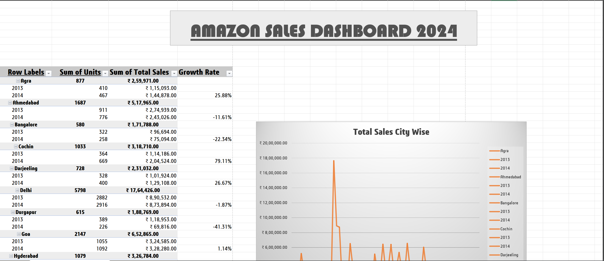

# InlighnTech-Excel-Project
This Excel project aims to create a dynamic Amazon Sales Dashboard showcasing key metrics like sales, units sold, and city/state trends. It includes doughnut charts for KPIs, line charts for city-wise data, and map visuals for state performance. 

Project Overview:
The Amazon Sales Dashboard project aims to develop an interactive and dynamic Excel dashboard that visualizes sales data across various metrics, such as cities, states, and product categories. This project is designed to provide insights into sales performance, identify trends, and support data-driven decisions.

Project Objectives:
To create a user-friendly dashboard that presents key sales metrics in a visually engaging manner.
To utilize Excel tools effectively, including charts, slicers, and formatting features, ensuring dynamic updates.
To develop a structured layout that simplifies data interpretation for stakeholders.

Methodology:
1. Dataset Preparation:
Data Collection: Gather data including Sales Amount, Units Sold, City, State, Product Category, and Date of Sale.
Data Cleaning: Ensure data consistency by:
Formatting sales data in Indian Rupees (₹).
Ensuring each column maintains a uniform data type.
Filtering out null or incorrect data entries.
2. Layout and Structure Design:
Add a title, "Amazon Sales Dashboard 2024," prominently at the top.
Create summary cards displaying key metrics:
Total Sales Amount
Total Units Sold
Number of Cities Covered
Utilize bold fonts and prominent placements for clear visualization.
3. Graphs and Visuals Implementation:
Sales Summary Card:
Use doughnut charts to display completion percentages for key sales targets.
Differentiate target vs. actual values using distinct colors.
City-wise Sales:
Employ a Line Chart with cities on the X-axis and sales amounts on the Y-axis.
Highlight top-performing cities for emphasis.
State-wise Sales:
Use an Excel Map Chart to depict sales distribution across states.
Apply gradient color scales to visualize sales density effectively.
Product-wise Units Sold:
Design horizontal bar chart ranking product categories by units sold.
4. Enhancing Visual Appeal:
Apply cohesive color themes with neutral backgrounds and accent hues for clarity.
Utilize borders and subtle shadows to add depth and a professional finish.
5. Interactivity and Functionality:
Test functionality to ensure all visual elements respond dynamically to filter changes.
Conduct data validation checks to confirm the accuracy of displayed information.
6. Final Touches and Sharing:
Save the completed dashboard in both .xlsx (editable) and .pdf (for easy sharing) formats.

